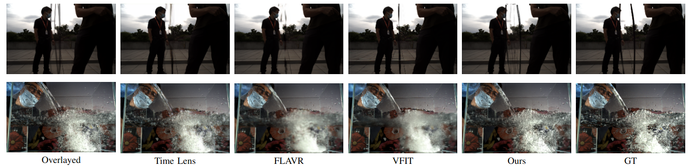

# E-VFIA : Event-Based Video Frame Interpolation with Attention  
  
by  
Onur Selim Kılıç [[GitHub](https://github.com/OnurSelim), [LinkedIn](https://www.linkedin.com/in/onur-selim-kili%C3%A7-6486371a7/)],  
Ahmet Akman [[GitHub](https://github.com/ahmetakman), [LinkedIn](https://linkedin.com/in/ahmet-akman-039b05148)],  
A. Aydın Alatan [[Website](https://users.metu.edu.tr/home105/alatan/wwwhome/), [LinkedIn](https://linkedin.com/in/a-aydin-alatan-864820)] 
  
  
 [[Paper](https://arxiv.org/abs/2209.09359)]  
  
This paper is accepted for publication in [ICRA23](https://www.icra2023.org/).

  
  
*Qualitative comparisons against the state-of-the-art video interpolation algorithms.*  
  
  
## Abstract  
  
Video frame interpolation (VFI) is a fundamental vision task that aims to synthesize several frames between two consecutive original video images. Most algorithms aim to accomplish VFI by using only keyframes, which is an ill-posed problem since the keyframes usually do not yield any accurate precision about the trajectories of the objects in the scene. On the other hand, event-based cameras provide more precise information between the keyframes of a video. Some recent state-of-the-art event-based methods approach this problem by utilizing event data for better optical flow estimation to interpolate for video frame by warping. Nonetheless, those methods heavily suffer from the ghosting effect. On the other hand, some of kernel-based VFI methods that only use frames as input, have shown that deformable convolutions, when backed up with transformers, can be a reliable way of dealing with long-range dependencies. We propose event-based video frame interpolation with attention (E-VFIA), as a lightweight kernel-based method. E-VFIA fuses event information with standard video frames by deformable convolutions to generate high quality interpolated frames. The proposed method represents events with high temporal resolution and uses a multi-head self-attention mechanism to better encode event-based information, while being less vulnerable to blurring and ghosting artifacts; thus, generating crispier frames. The simulation results show that the proposed technique outperforms current state-of-the-art methods (both frame and event-based) with a significantly smaller model size.

## Packages
The following packages are required to run the code:
* cupy==7.5.0
* cudatoolkit==10.1
* einops==0.3.0
* pillow==8.2.0
* python==3.7.6
* pytorch
* torchvision==0.6.1
* timm
* tqdm
It is strongly recommended to use [conda](https://www.anaconda.com/) environment. 

## Train

* Download the [BS-ERGB](https://github.com/uzh-rpg/timelens-pp) dataset.
* Move the dataset-txt files into dataset folder. 
* Then train E-VFIA using default training configurations:
* Or you can edit the config.py for your own preferences.

```
python main.py --data_root <dataset_path>
```


## Test
After training, you can evaluate the model with following command:
* Or you can edit the config.py for your own preferences.
```
python test.py --data_root <dataset_path> --load_from pretrained/model_best.pth
```
You can also evaluate E-VFIA using our weight [here](https://drive.google.com/drive/folders/1aS81DQzX8YHK3cfLmLv97rwCrbt4xDv6?usp=sharing).


Please consider citing this paper if you find the code useful in your research:
```
@misc{https://doi.org/10.48550/arxiv.2209.09359,
  doi = {10.48550/ARXIV.2209.09359},
  url = {https://arxiv.org/abs/2209.09359},  
  author = {Kılıç, Onur Selim and Akman, Ahmet and Alatan, A. Aydın},
  title = {E-VFIA : Event-Based Video Frame Interpolation with Attention},
  publisher = {arXiv},
  year = {2022},
  copyright = {arXiv.org perpetual, non-exclusive license}
}

```

## References
Great video frame interpolation resources that we made use of:
* VFIT: Video Frame Interpolation Transformer, CVPR 2022 [Code](https://github.com/zhshi0816/Video-Frame-Interpolation-Transformer)
* TimeLens: Event-based Video Frame Interpolation, CVPR 2021 [Code](https://github.com/uzh-rpg/rpg_timelens )
* FLAVR: Flow-Agnostic Video Representations for Fast Frame Interpolation, arXiv 2021 [Code](https://github.com/tarun005/FLAVR)
* QVI: Quadratic Video Interpolation, NeurIPS 2019 [Code](https://github.com/xuxy09/QVI)
* AdaCoF: Adaptive Collaboration of Flows for Video Frame Interpolation, CVPR 2020 [Code](https://github.com/HyeongminLEE/AdaCoF-pytorch)
